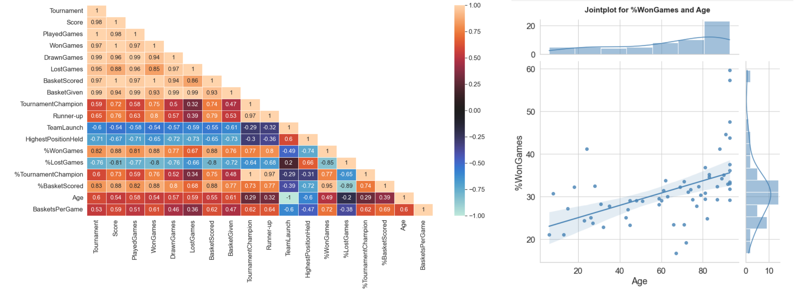

# Exploratory data analysis

## Recommend basketball team using statistical analysis

 A company wants to invest on proposals on managing some of the best teams in the league. Hence the company wants to understand, which teams they can approach, which will be a deal win for them. In this project, past tournament information was analysed to make informative decisions. <b>Statistical and visualisation</b> techniques such as histograms, barcharts, piecharts, heatmap, pair-wise scatterplot, joint-plot, box-plot etc are used to perform exploratory data analysis and come up with performance metrics to help in decision making.
 

## ML libraries
Pandas, NumPy, Seaborn, Matplotlib, SciPy
